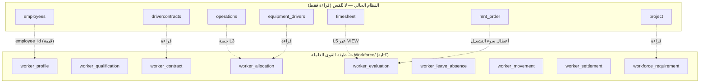

# تقرير تنفيذ مواصفات القوى التشغيلية الميدانية (EQUIP-OPE-S04) — النسخة المختصرة المعتمدة

> تنفيذ المستند داخل نظام EMS كـ**طبقةٍ جديدةٍ مستقلّةٍ (Bolt-on Layer)** فوق النظام الحالي، دون **أي تعديلٍ أو لمسٍ** لجداوله أو شاشاته أو علاقاته — تُقرأ منه فقط. الأولوية للمعيارية العالمية والمراجعة العكسية والتكامل، مع **اختصارٍ متوازنٍ لا يكسر الدورة ولا المنطق ولا التطبيع**.
>
> التاريخ: 2026-06-25 · الحالة: معتمدة للنقاش التنفيذي · المرجع: `EQUIP-OPE-S04 v1.0`

---

## 0. الملخّص التنفيذي

المبدأ الحاكم: **صِفر تعديلٍ على القائم** (لا `ALTER`، لا لمس شاشةٍ أو علاقة) — كل وظائف المستند تُبنى كوحدةٍ جديدةٍ `Workforce/` بجداولها الخاصّة، تتكامل بالقراءة فقط.

بعد الاختصار المتوازن (المعتمد): المستند يُنفَّذ بـ**8 شاشات** (+1 مرجعية للسكن) و**14 جدولاً جديداً + 3 Views**، مقابل **0 تعديلٍ** على القائم (~12 جدولاً يُقرأ منها فقط). الاختصار **يتبع منطق المستند نفسه** (يدمج المزدوج منطقياً، ويحوّل المحسوب إلى Views، ويطوي جداول الأبناء المعروفة إلى أعمدة) فلا يكسر الدورة ولا يفقد التطبيع 3NF.

---

## 1. سِجِلّ القرارات المعتمدة (قبل التنفيذ)

| # | القرار | المعتمد |
|---|---|---|
| 1 | العقد التشغيلي `worker_contract` | **مستقلٌّ تماماً** عن `drivercontracts` |
| 2 | فئة العامل `worker_category` | **جديدةٌ** (قيم المستند السبع) + تعيينٌ آليٌّ أوليٌّ من `employee_type` |
| 3 | ربط L4→L5 | **VIEW** بمطابقةٍ دقيقة: `timesheet.operator = operation_id` و`timesheet.employee_id = worker_profile.employee_id` — بلا لمس التايم‌شيت |
| 4 | الاعتمادات ودورة الحياة | **آلات حالةٍ مستقلّة** (state + حارس انتقال) داخل جداول الطبقة |
| 5 | المالية | **إدخالٌ يدويٌّ** + حقول تعليقاتٍ مرجعيةٍ في كل حقلٍ ماليٍّ للرجوع إليها عند إنشاء الإدارة المالية |
| 6 | مرشّحو الاحتياج (8.10) | **إدخالٌ يدويٌّ** الآن (حقلٌ في `workforce_requirement`) + خطّاف تكاملٍ لاحق |
| 7 | العهدة والسكن (8.11) | **سكنٌ جديد** `housing_unit` + **تأجيل العهدة** (حقلٌ مرجعيٌّ فارغ) |
| 8 | إنشاء `worker_profile` | **عند التصنيف يدوياً** من شاشة السجل |
| 9 | هرم الإسناد | L3=`operations` (آلية↔مشروع) · **L4=`equipment_drivers`** (عامل↔آلية، القائم) · L5=`timesheet`؛ `worker_allocation` طبقة إثراءٍ لا تكرّر العامل↔الآلية؛ السقف = صفوف equipment_drivers النشطة ≤ daily_operators |
| 10 | المعدات المطقّمة/الطاقم | **مضمَّنةٌ الآن** (`crew_role` + `lead_allocation_id` في التخصيص) |
| 11 | الحالة الميدانية | **VIEW محسوبٌ** يكتمل تدريجياً مع الشاشات |
| 12 | تكويد العامل/العقد | **يدويٌّ** كما في `employee_code` |

**افتراضاتٌ تشغيليةٌ مرافقة:** كل جدولٍ جديدٍ يحمل `company_id` بنفس عزل النظام · الشاشات تُسجَّل في `modules` وتُمنَح للدور 3 (مدير المشغلين = الموارد البشرية) · كل مسارات الكتابة Prepared Statements + Transactions · واجهةٌ عربيةٌ RTL · `worker_profile.employee_id` فريدٌ (1:1) · حذف الطبقة يعيد النظام لحالته الأصلية.

---

## 2. المبدأ المعماري: طبقةٌ مستقلّةٌ فوق نظامٍ غير ملموس



كل الأسهم من الإرث إلى الطبقة **قراءةٌ بالقيمة**؛ لا سهم كتابةٍ يعود للقائم.

---

## 3. شكل النظام بعد التنفيذ

تظهر وحدةٌ جديدةٌ «القوى العاملة» يملكها الدور 3، بجانب الشاشات القديمة دون استبدالها:

```
Workforce/
  worker_register.php       ← 8.1 (تبويبات: التشغيلي · المهارات/الرخص 8.2 · السجل المجمّع 8.9)
  worker_contract.php       ← 8.3
  worker_allocation.php     ← 8.4
  worker_evaluation.php     ← 8.5
  worker_leave_absence.php  ← 8.6 + 8.13 (نوع: مخطّط/طارئ)
  worker_movement.php       ← 8.11 + 8.12 (نوع: تحرّك/نقل بين مشاريع)
  worker_settlement.php     ← 8.7
  workforce_requirement.php ← 8.10
app/Services/Workforce/     ← طبقة الخدمة (المحرّكات السبعة) — نقطة حقيقة واحدة
Settings/ (housing_unit)    ← إعدادات السكن (مرجعي)
database/migrations/2026_..._workforce_*.sql  ← CREATE TABLE/VIEW فقط
```

التايم‌شيت (8.8): **لا شاشة جديدة** — يُعاد استخدام القائم، والحضور والساعات المؤهَّلة تقريرٌ محسوبٌ عبر VIEW.

---

## 4. خريطة الاختصار (وكيف تحفظ الدورة والمنطق)

| الدمج | من → إلى | لماذا لا يكسر المنطق |
|---|---|---|
| 8.2 + 8.9 تبويبَين في 8.1 | 3 شاشات → 1 | المهارات ملكُها العامل، والسجل مقروءٌ فقط (Views) |
| 8.6 + 8.13 | 2 → 1 (`worker_leave_absence`) | كلاهما «خروجٌ من المتاح يستدعي تغطية»؛ نميّز بحقل النوع |
| 8.11 + 8.12 | 2 → 1 (`worker_movement`) | المستند: النقل **يُنفَّذ بأمر تحرّك** يغلق المصدر ويفتح الوجهة |
| `grade_history` ← `worker_qualification` | 2 → 1 جدول | `record_type` يشمل أصلاً «ترقية/تدرّج» |
| بدلات العقد أعمدةً | 2 → 1 جدول | مجموعةٌ ثابتةٌ معروفة (سكن/إعاشة/موقع/نقل) |
| الحوافز/الجزاءات أعمدةً في التقييم | 2 → 1 جدول | المستند يضع `amount` على التقييم |
| المرشّحون حقلاً في الاحتياج | 2 → 1 جدول | الإدخال يدويٌّ الآن (قرار 6) |
| التايم‌شيت VIEW بدل شاشة/جدول | -1 شاشة، -1 جدول | لا لمس للقائم؛ الحضور محسوبٌ استنتاجاً |
| ENUM بدل `workforce_lookup` | -1 جدول | الثوابت صغيرةٌ مستقرّة |

---

## 5. الجداول الجديدة (14 + 3 Views)

كلها تحمل `company_id`، ومفاتيح أجنبية **داخلية** بين جداول الطبقة، وروابط **بالقيمة** نحو الإرث.

| # | الجدول | الشاشة | جوهره وأبرز حقوله |
|---|---|---|---|
| 1 | `worker_profile` | 8.1 | امتداد 1:1 لـ`employees`؛ `worker_category`(جديد+تعيين آلي)، `source_type`، `workforce_class`، `job_grade`، `state`(آلة مستقلّة)، `medical_fitness_status`، `fitness_conditions`، `primary_backup_id`، `is_replaceable`، `code`(يدوي) |
| 2 | `worker_qualification` | 8.2 | `record_type`(مؤهل/رخصة/خبرة/**ترقية**)، `issue/expiry_date`، `is_critical`، `alert_lead_days`، `proficiency_level` |
| 3 | `worker_backup` | 8.1 | بدائل إضافية M:M (`backup_worker_id`، `backup_type`: احتياطي/مؤقت) |
| 4 | `worker_restricted_site` | 8.1/8.2 | مواقع محظورة طبياً M:M (`worker_id`,`project_id`) |
| 5 | `worker_contract` | 8.3 | **مستقل**؛ `contract_type`(11)، `wage_method`، `rotation_pattern`، `next_rotation_date`، `fixed_wage_ratio`، `monthly_hours_base`، `billable_downtime`، أعمدة البدلات الأربع، `*_finance_note`، `state`، `code`(يدوي) |
| 6 | `worker_allocation` | 8.4 | **طبقة إثراءٍ** فوق `equipment_drivers` (L4 القائم)؛ `worker_id`، `equipment_driver_id`(مرجع قيمة)، `operation_id`(**مرجع L3 = operations**)، `consumed_qty`(view)، `state`(مستقلّة)، `crew_role`، `lead_allocation_id`، `coverage_reason`، `active_backup_id`، `source_type`. لا يكرّر واقعة العامل↔الآلية |
| 7 | `worker_evaluation` | 8.5 | `period`، `score`(محسوب)، `amount`+`incentive_penalty_type`(مدمج)، `*_finance_note`، `state` |
| 8 | `worker_evaluation_kpi` | 8.5 | بنود المؤشرات (ابن 1:N للتقارير) |
| 9 | `worker_leave_absence` | 8.6+8.13 | `event_class`(مخطّط/طارئ)، `event_type`، `date_from/to`، `substitute_id`، `rotation_*`، `coverage_impact`، `outcome`، `state` |
| 10 | `worker_settlement` | 8.7 | `worker_id`، `worker_contract_id`، `source_type`، `settlement_party`، `settlement_basis`، `net_amount`(محسوب)، `*_finance_note`، `state` |
| 11 | `worker_settlement_line` | 8.7 | بنود المستحقات/الخصومات (ابن 1:N) |
| 12 | `worker_movement` | 8.11+8.12 | `direction`(التحاق/عودة/مغادرة/**نقل**/مغادرة نهائية)، `allocation_id`، `origin`، `destination_project_id`، `from/to_project_id`، `transfer_type`، `transport_mode`، التواريخ، `received_by`، `housing_unit_id`، `safety_kit_received`، `custody_received`(مؤجّل)، `state` |
| 13 | `workforce_requirement` | 8.10 | `project_id`، `worker_category`، `required/available/shortage/surplus`، `is_critical`، `priority`، `need_date`، `fulfillment_stage`، `candidates_note`(يدوي) |
| 14 | `housing_unit` | 8.11 (مرجعي) | `project_id`، السعة، الإشغال (محسوب من التحرّكات) |

**Views (للقراءة فقط):** `v_worker_presence` (8.1 — الحالة الميدانية) · `v_worker_billable_hours` (8.8 — من `timesheet`+`worker_contract`) · `v_worker_worklog` (8.9 — السجل المجمّع).

---

## 6. الشاشات الجديدة (8 + 1 مرجعية)

| # | الشاشة | يقرأ من الإرث | يكتب في الجديد |
|---|---|---|---|
| 1 | سجل العامل (8.1 +8.2 +8.9) | `employees` (الهوية) | `worker_profile`/`qualification`/`backup`/`restricted_site` |
| 2 | عقد العامل (8.3) | `drivercontracts` (مرجع) | `worker_contract` |
| 3 | تخصيص العامل L4 (8.4) | `operations`(L3)/`equipment_drivers` | `worker_allocation` |
| 4 | التقييم والحوافز والجزاءات (8.5) | `timesheet`/`mnt_order` | `worker_evaluation`/`kpi` |
| 5 | الإجازات والغياب (8.6+8.13) | — | `worker_leave_absence` |
| 6 | التحرّك والنقل (8.11+8.12) | `project`/`housing_unit` | `worker_movement` |
| 7 | تسوية العامل (8.7) | — | `worker_settlement`/`line` |
| 8 | الاحتياج والتخطيط (8.10) | `project`/التخصيصات | `workforce_requirement` |
| — | إعدادات السكن (مرجعي) | — | `housing_unit` |
| — | التايم‌شيت (8.8) | **`timesheet` كما هو** | لا كتابة — تقرير/VIEW |

---

## 7. التكامل والمحرّكات

طبقة خدمةٍ مركزية (`app/Services/Workforce/`) تستضيف المحرّكات السبعة وتُستدعى من الشاشات الجديدة وحدها (نقطة حقيقة واحدة): الحصص (L4 ≤ L3 من `operations`) · الجاهزية البشرية (state + اللياقة + صلاحية الرخص) · الاعتمادات (cron على `worker_qualification.expiry_date`) · التناوب (من `worker_contract`) · التغطية (من `worker_backup`/`worker_leave_absence`) · الأحداث (الحوافز/الجزاءات من `worker_evaluation`) · التخطيط (Views تقابل `workforce_requirement` بالتخصيصات). الموافقات والتتبّع: آلات حالةٍ مستقلّةٌ داخل الجداول + إدراجٌ في `activity_logs` بلا تعديل بنية.

---

## 8. ضمان عدم الكسر — قائمة تحقّقٍ عكسية

- صفر `ALTER TABLE` على أي جدولٍ قائم — `CREATE TABLE/VIEW` فقط.
- صفر تعديلٍ لملفات الشاشات القائمة — الوحدة في مجلدٍ منفصل.
- صفر قيد FK مفروضٍ على جداولٍ قديمة — الربط بالقيمة.
- اختبار انحدارٍ للشاشات القديمة قبل/بعد كل موجة.
- قابلية تراجعٍ كاملة: حذف الطبقة يعيد النظام لحالته الأصلية.

---

## 9. خطة الموجات

1. **م0:** مجلد `Workforce/` + طبقة الخدمة + تسجيل الموديولات/الصلاحيات + تهجيرات الإنشاء.
2. **م1:** 8.1 سجل العامل (`worker_profile` +المهارات 8.2) + محرّك الاعتمادات.
3. **م2:** 8.3 العقد + 8.4 التخصيص L4 فوق محرّك الحصص (مرجع `operations`).
4. **م3:** التايم‌شيت VIEW (الحضور/الساعات المؤهَّلة) + 8.5 الإجازات والغياب + 8.6 التحرّك والنقل.
5. **م4:** 8.5 التقييم + 8.7 التسوية + 8.10 الاحتياج والتخطيط.
6. **م5:** Views المجمَّعة (8.9) ولوحة المؤشّرات.

كل موجةٍ على staging مع اختبار انحدارٍ للقديم قبل الإنتاج.

---

## 10. الملخّص العددي النهائي

| البند | معدّل من القائم | جديد |
|---|---|---|
| **الجداول** | 0 (يُقرأ من ~12) | **14 جدولاً + 3 Views** |
| **الشاشات** | 0 | **8 شاشات (+1 مرجعية)** · التايم‌شيت تقرير |
| **الأدوار** | 0 (الدور 3) | 0 |
| **علاقات الإرث** | 0 (قراءة فقط) | روابطٌ بالقيمة من الجديد للقديم |

**النتيجة:** منصّةٌ إداريةٌ مختصرةٌ ومتكاملةٌ للقوى العاملة، مبنيّةٌ كطبقةٍ نظيفةٍ معياريةٍ فوق نظامٍ لم يُلمَس — دورةٌ كاملةٌ محفوظة، تطبيعٌ سليم، وصفرُ خطرٍ على الإنتاج.
